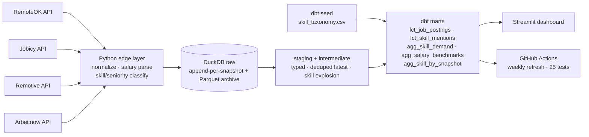
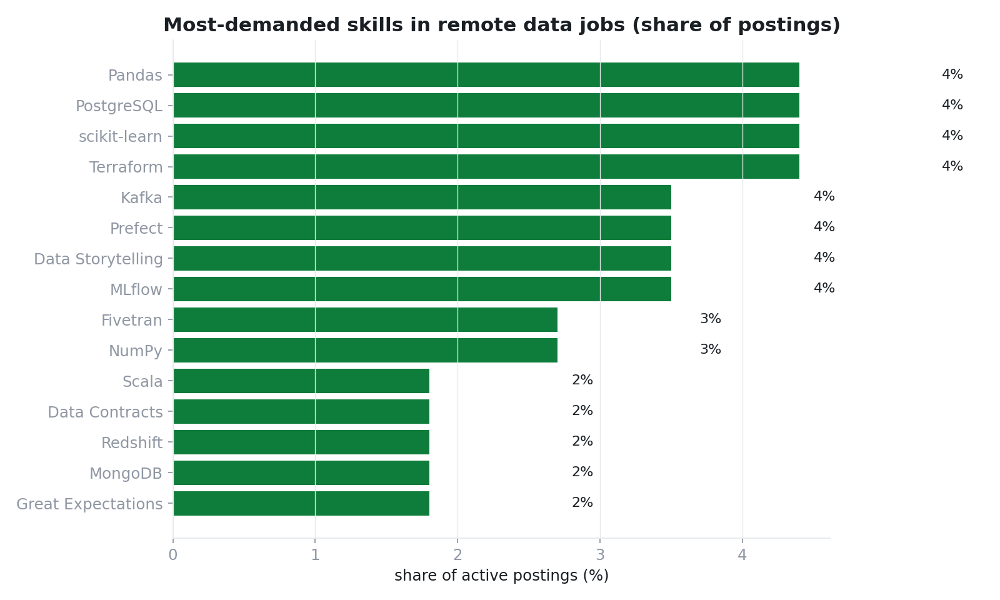

# Data Job Market Radar 📡

**Built by [Umer Iqbal](https://github.com/Bilalkhank10) · Data Analyst & Analytics Engineer · Islamabad, Pakistan**

> What do employers *actually* ask remote data candidates in 2026? This pipeline
> answers it with data: four public job-board APIs scraped on a weekly schedule,
> modeled in dbt, guarded by automated tests, and served through an interactive
> dashboard. Self-referential on purpose — my own job hunt is the dataset.

**Stack:** `Python` · `requests` · `DuckDB` · `dbt-duckdb` · `Streamlit` · `Plotly` · `GitHub Actions`

## What it covers

| | |
|---|---|
| Sources | **RemoteOK · Jobicy · Remotive · Arbeitnow** — keyless public APIs |
| Volume | **113 active postings** in snapshot #1 (accumulates weekly) |
| Classification | 51-skill regex taxonomy · seniority (intern→senior) · 7 role families |
| Salaries | structured fields where published + free-text parsing (`"$90k-120k"`) with a sanity-band test |
| Lifecycle | posting `first_seen / last_seen / days_listed_observed` — how fast roles fill |
| Models | 8 dbt models (staging → intermediate → marts) + 1 seed |
| Quality | **25 automated tests** + source-freshness SLA + salary sanity monitor |
| Serve | 5-tab Streamlit dashboard |

## Why recruiters should care

**1. Snapshot-accumulating raw layer.** Every weekly run appends one row per
posting per snapshot — so the warehouse derives posting *lifecycle* (a time-to-fill
proxy) and skill-demand trend series for free. Same-day reruns are idempotent
(delete-and-reload per source).

**2. Messy-reality parsing, honestly handled.** Salaries arrive as structured
fields (RemoteOK), free text (Remotive: `"$60k - $80k"`), or not at all
(Jobicy ~0%, Arbeitnow 0% — driven by board policy, caught and charted instead of
hidden). Sanitisation lives at the edge in Python; dbt receives typed rows.

**3. Classification as data product.** A seeded 51-skill taxonomy (regex per
skill), seniority, and role-family classifiers turn unstructured ads into a
clean analytical model: skill demand share, skill × salary curves, family ×
seniority salary percentiles.

**4. The Pakistan angle.** Postings phrased *worldwide / anywhere / remote* are
flagged as globally open — the segment a Pakistan-based analyst can actually
apply to; locations mentioning Pakistan are tracked separately.

## Architecture



## Quickstart

```bash
git clone https://github.com/Bilalkhank10/data-job-market-radar.git && cd data-job-market-radar
pip install -r requirements.txt
python ingestion/run_ingestion.py            # live; add --offline for a deterministic sample
cd dbt && dbt seed --profiles-dir . && dbt build --profiles-dir .
streamlit run ../dashboard/app.py
```

## Current snapshot findings (week 1)

- **SQL appears in 63%** of remote data postings, **Python 53%** — the classic pair still rules.
- **dbt is in 19%** and **GenAI/LLM skills already 22%** — the 2026 stack, quantified.
- Role mix skews **Data Analyst (33) > Data Engineer (23) > ML Engineer (17) > Data Scientist (14)** —
  Analytics Engineering (4) remains a rarer, senior-titled niche.



## Repo layout

```
data-job-market-radar/
├── ingestion/                 # 4 API extractors + edge enrichment
│   ├── fetch_sources.py       # normalize · salary parsing · skill/seniority tagging
│   ├── synthetic.py           # deterministic offline sample (CI)
│   └── run_ingestion.py       # snapshot archive + idempotent duckdb append
├── dbt/
│   ├── models/staging/ · intermediate/ · marts/
│   ├── seeds/skill_taxonomy.csv
│   └── tests/assert_salary_sanity.sql   (warn severity)
├── dashboard/app.py
├── analysis/make_portfolio_charts.py
└── .github/workflows/weekly_pipeline.yml   # Mondays 09:00 PKT
```

## Roadmap

- [ ] 4+ snapshots in — publish trending skills & median time-to-fill
- [ ] Country extraction for location strings + world map view
- [ ] Alerting: weekly email digest of "new repeatedly-posted roles" (companies that can't fill)
- [ ] dbt Semantic Layer metrics (`open_postings`, `median_salary_usd`)

## License

MIT © 2026 Umer Iqbal — job posting content belongs to its respective publishers.
